# Plan de Pruebas de Rendimiento: Integración SOINDI -> Odoo vía RabbitMQ

Este documento detalla el plan de pruebas para medir y optimizar el rendimiento de la actualización de inventario desde un sistema on-premise (SOINDI) a una instancia de Odoo 17 en AWS, utilizando RabbitMQ como message broker.

## 1. Análisis y Arquitectura

La arquitectura de producción es un modelo híbrido que involucra tres zonas de red distintas. El rendimiento del sistema depende de la latencia en cada uno de los saltos entre estas zonas.

- **On-Premise:** Ubicación del sistema de origen (SOINDI) y, por tanto, de los **productores** de mensajes.
- **AWS Cloud (Broker):** Donde se hospeda el servicio de RabbitMQ.
- **AWS Cloud (Aplicación):** Donde residen Odoo 17, su base de datos PostgreSQL y los **consumidores** de mensajes.

El flujo de datos completo a medir es: `Productor (On-Premise) -> RabbitMQ (Cloud) -> Consumidor (Cloud) -> API de Odoo (Cloud) -> Base de Datos`.

## 2. Métricas Clave a Medir

Para evaluar el rendimiento, nos centraremos en las siguientes métricas, que serán capturadas por los scripts de Python instrumentados:

1.  **Latencia End-to-End (`T_end_to_end`):** Tiempo total desde que el productor envía el mensaje hasta que el consumidor confirma que Odoo ha procesado la actualización. Mide la experiencia completa.
2.  **Latencia del Broker (`T_broker`):** Tiempo desde que el productor envía el mensaje hasta que el consumidor lo recibe. Aísla el rendimiento de la red (WAN/VPN) y de RabbitMQ.
3.  **Tiempo de Procesamiento del Consumidor (`T_consumer`):** Tiempo que tarda el consumidor en procesar un mensaje (desde que lo recibe hasta que finaliza la llamada a la API de Odoo). Mide el rendimiento de la lógica del consumidor y la capacidad de respuesta de la API de Odoo.
4.  **Throughput (Rendimiento):** El número de mensajes procesados por segundo. Esencial para pruebas de estrés.

## 3. Plan de Pruebas y Diagramas

A continuación se presentan los casos de prueba con sus respectivas arquitecturas.

### Caso de Prueba 1: Medición de la Línea Base Realista

-   **Objetivo:** Establecer el rendimiento base de la arquitectura de producción más probable y óptima, con el consumidor co-ubicado con Odoo.
-   **Arquitectura:** Productor on-premise, RabbitMQ en la nube, Consumidor y Odoo en el mismo servidor/VPC en AWS.

**Diagrama:**

### Caso de Prueba 2: Evaluación del Impacto de la Colocación del Consumidor

-   **Objetivo:** Cuantificar el sobrecoste de latencia al ejecutar el consumidor en un servidor separado de Odoo dentro de AWS.
-   **Arquitectura:** El consumidor se ejecuta en su propio servidor EC2, comunicándose con Odoo a través de la red interna de AWS.

**Diagrama:**

### Caso de Prueba 3: Optimización Crítica con Procesamiento por Lotes (Batching)

-   **Objetivo:** Medir la ganancia de rendimiento al implementar el procesamiento por lotes, reduciendo el número de llamadas a la API de Odoo.
-   **Metodología:** El consumidor acumula N mensajes y los envía en una única llamada a la API de Odoo.

**Diagrama de Lógica del Consumidor:**

## 4. Soluciones y Optimizaciones Potenciales

1.  **Batching en el Consumidor (Máxima Prioridad):** Es la optimización más importante. Reducir las llamadas a la API de Odoo de una por mensaje a una por cada N mensajes disminuirá drásticamente la latencia y aumentará el throughput.
2.  **Optimización del Lado del Productor:**
    *   **Publicación en Lote (Publisher Confirms):** Reducir los viajes de ida y vuelta a través de la red WAN para confirmar la publicación de mensajes.
    *   **Compresión de Mensajes:** Usar `gzip` o similar para reducir el tamaño de los mensajes antes de enviarlos por la red.
3.  **Colocación de Recursos en AWS:** Mantener al consumidor y a Odoo lo más cerca posible en términos de red (misma VPC, misma subred, `Placement Groups`).
4.  **Escalabilidad Horizontal:** Si un solo consumidor no es suficiente, añadir más instancias para procesar mensajes de la misma cola en paralelo.

## 5. Estado de la Instrumentación

Los scripts `python/producer/producer.py` y `python/consumer/consumer.py` ya han sido modificados para:
-   Conectarse a un host de RabbitMQ definido por la variable de entorno `RABBITMQ_HOST`.
-   Inyectar y procesar timestamps para calcular y mostrar automáticamente las métricas de rendimiento en la consola del consumidor.
